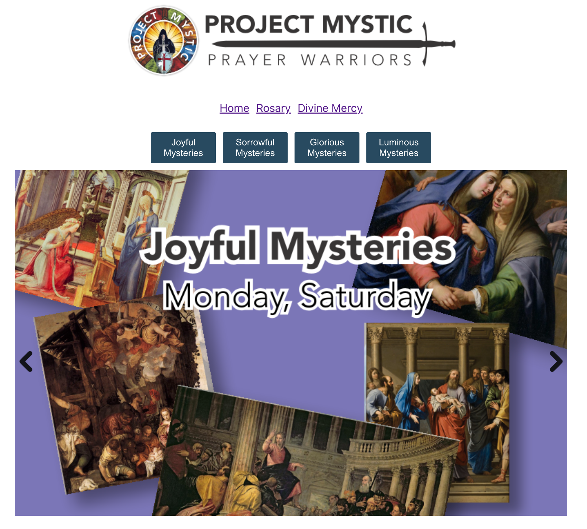

# Project Mystic

* https://servant-savio.github.io/mystic/

## Screenshots
### Desktop

### Phone

## Follow us

&nbsp;&nbsp;

## Acknowledgements
* Thanks to https://github.com/mborders/vulgata/ for bible json data.

